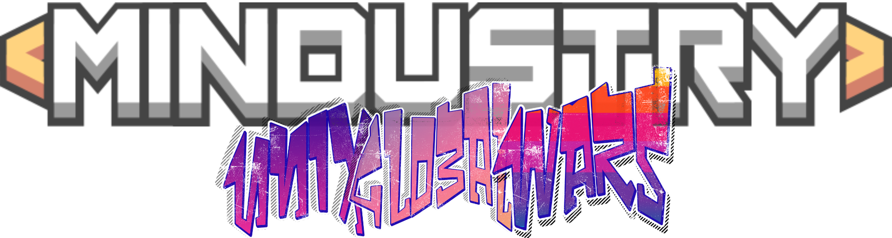

🇮🇩 Bahasa Indonesia

Mod ini dirancang sebagai mod yang menambahkan konten ekstra yang cukup luas dan unik ke dalam game.
Tujuan utama dari mod ini adalah memberikan pengalaman bermain yang lebih bervariasi dan menarik bagi pemain.

Mod ini tersedia dalam dua versi, yaitu JSON dan Java:

Versi JSON
Versi ini lebih sederhana dan stabil, fokus pada penambahan konten dasar tanpa mekanisme yang terlalu kompleks.
Cocok digunakan untuk penggunaan umum dan mudah dikembangkan lebih lanjut.

Versi Java
Versi Java memiliki fitur yang lebih banyak dan lebih kompleks, namun saat ini masih dalam tahap pengembangan awal.
Beberapa fitur mungkin belum sempurna karena pengembang masih dalam proses belajar dan pengembangan kemampuan.

Pengembangan mod ini akan terus berlanjut seiring meningkatnya pengalaman dan pemahaman developer.

🇬🇧 English Version

This mod is designed to add extra content that is fairly large and unique to the game.
Its main goal is to provide a more varied and engaging gameplay experience for players.

The mod is available in two versions, namely JSON and Java:

JSON Version
This version is simpler and more stable, focusing on basic content additions without complex mechanics.
It is suitable for general use and easy to expand in the future.

Java Version
The Java version includes more features and more complex systems, but it is still in an early development stage.
Some features may be unfinished, as the developer is still learning and improving their skills.

Development of this mod will continue as the developer gains more experience.